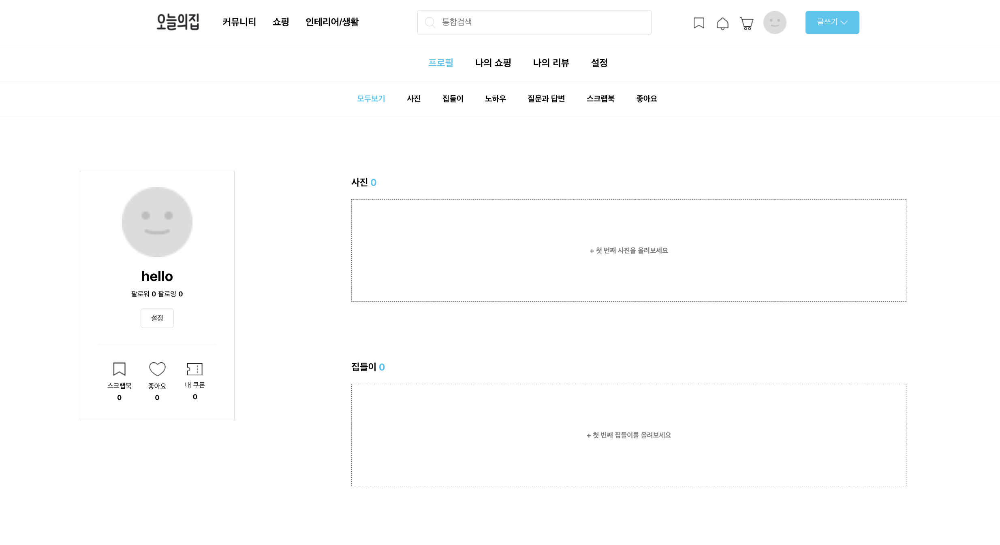
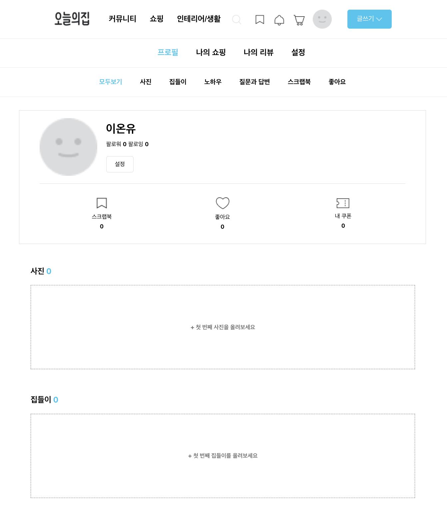
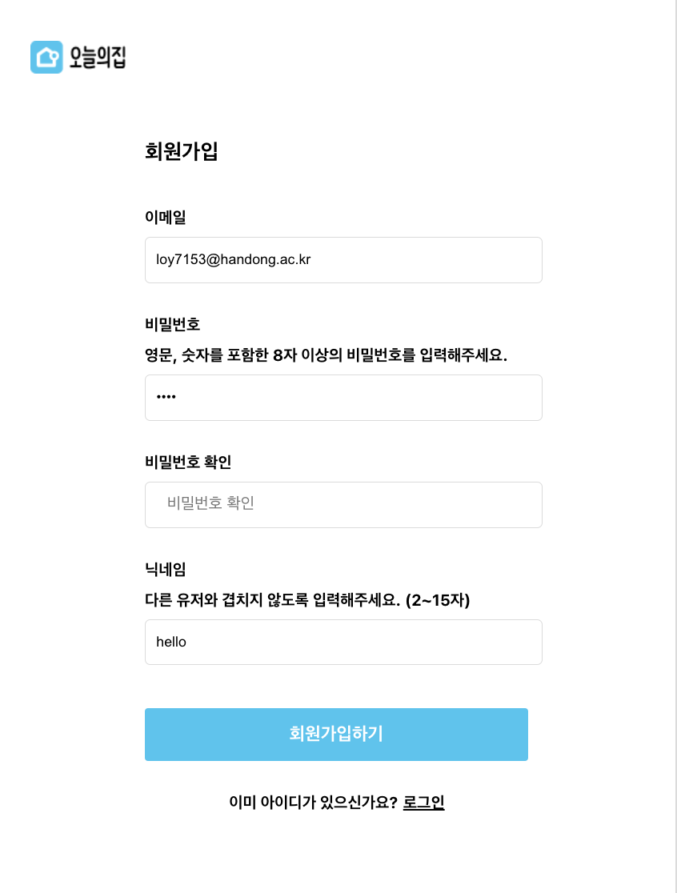
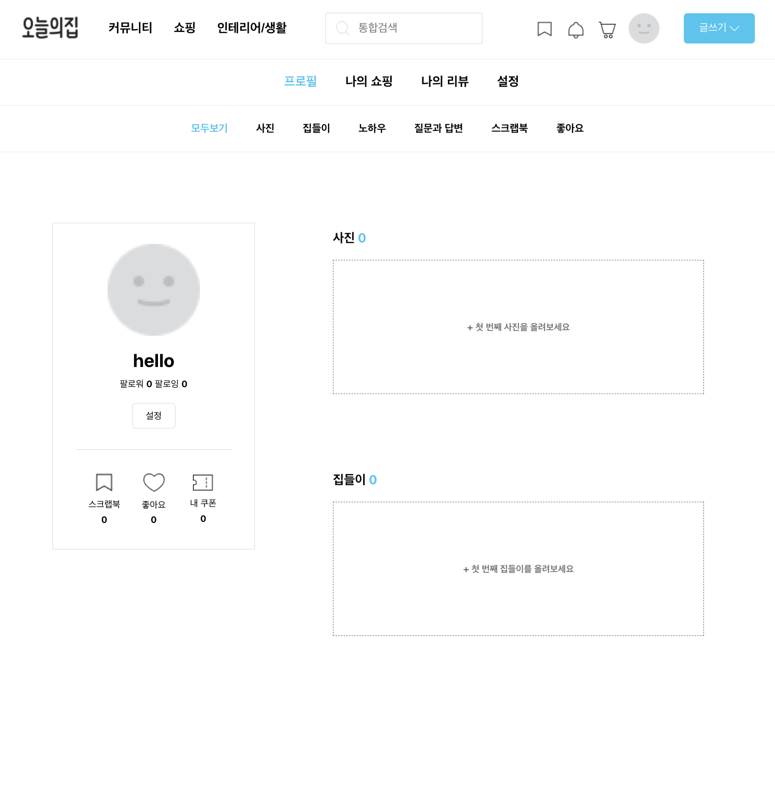
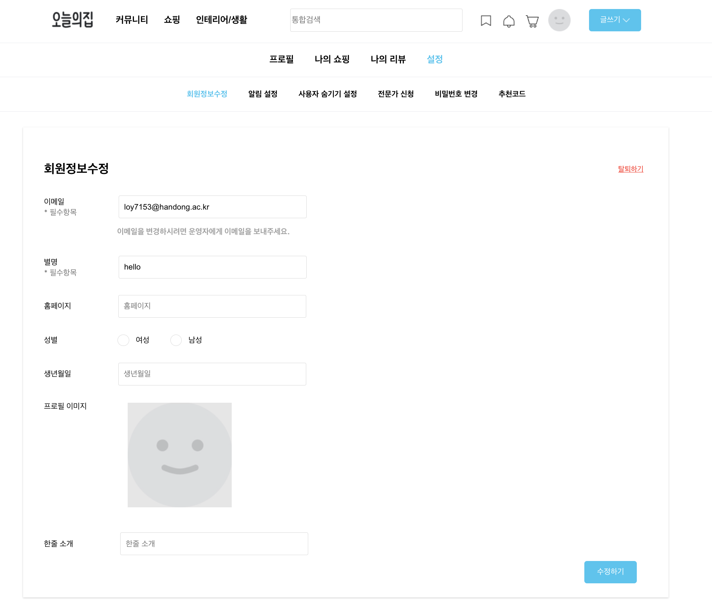
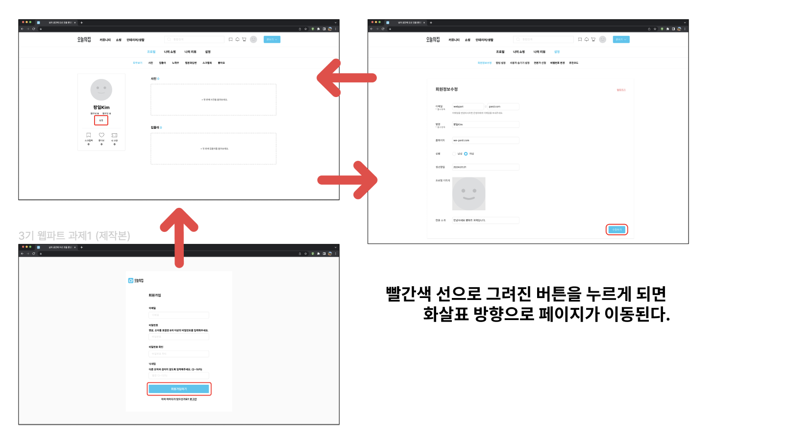
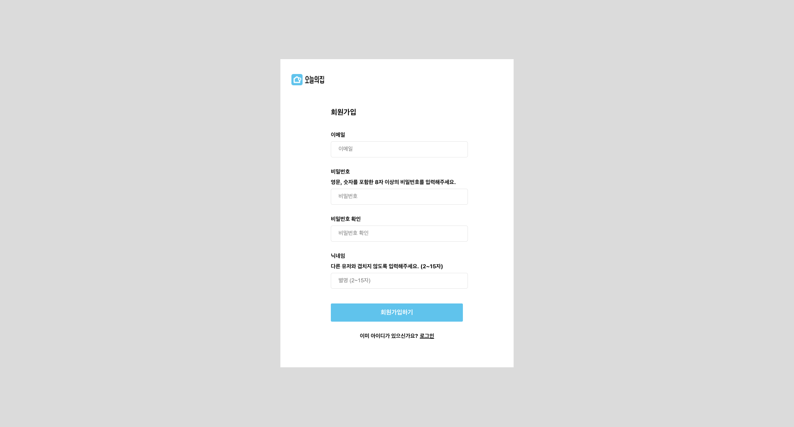
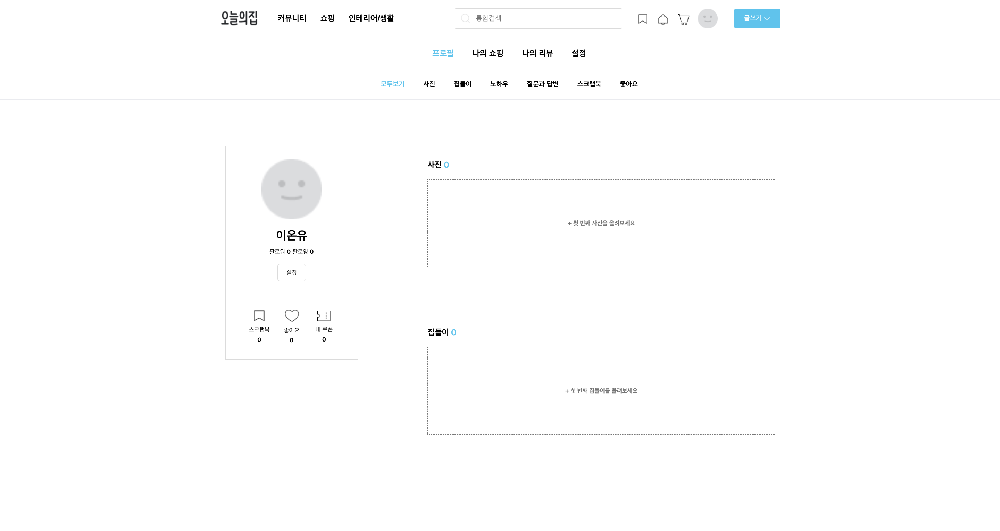
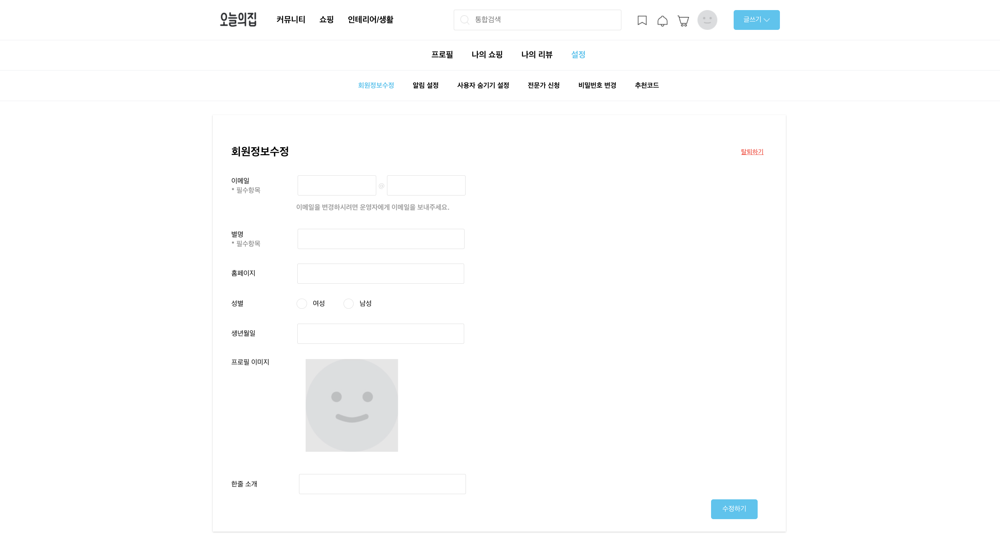

# HW#4
${\textsf{\color{#FF0000}지각 제출}}
## 과제 목표
- 전역 상태 라이브러리 Recoil을 사용할 수 있다.
- 반응형 웹 디자인을 구축할 수 있다.

### 반응형 웹
#### labtop

#### tablet

#### mobile

### Recoil
 

이메일과 비밀번호 저장 및 수정

# WEB_PART HW#2, HW#3
## 과제 목표
- React의 Router 라이브러리를 사용할 수 있다.
- URL 파라미터와 쿼리 스트링의 차이를 이해할 수 있다.
- Outlet을 통해 중첩 라우트를 구현할 수 있다.

## 과제설명
### 페이지 별 연결하기
목적 : 모든 페이지 별 페이지 이동에 대한 연습을 하는 부분!

#### RegisterPage

#### Profile

#### EditPage

한줄평:
기본 스타일을 버튼으로 한게 많아 `styled link`를 이용하여 `route`응용
코드가 좀 더러운 것 같아서 다음에는 더 깔끔하게...!