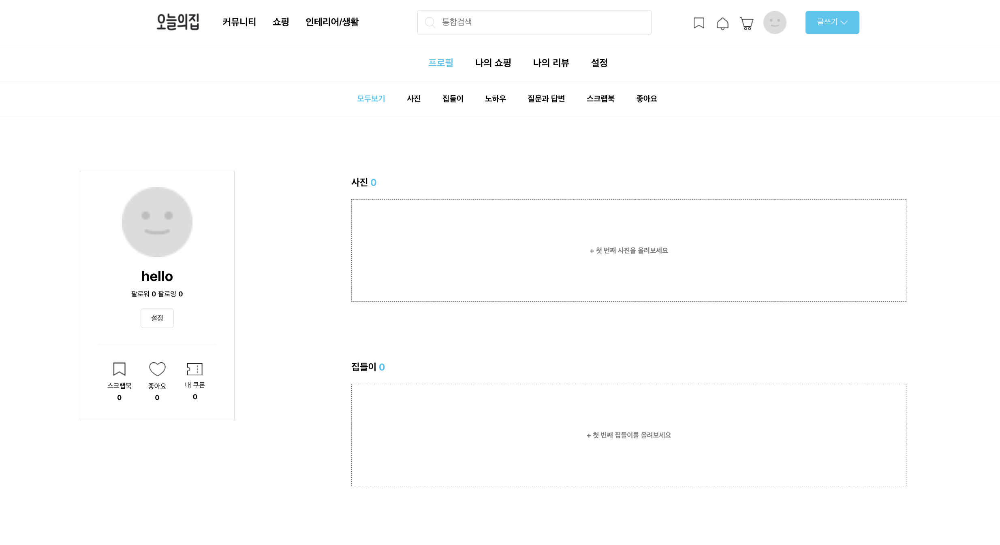
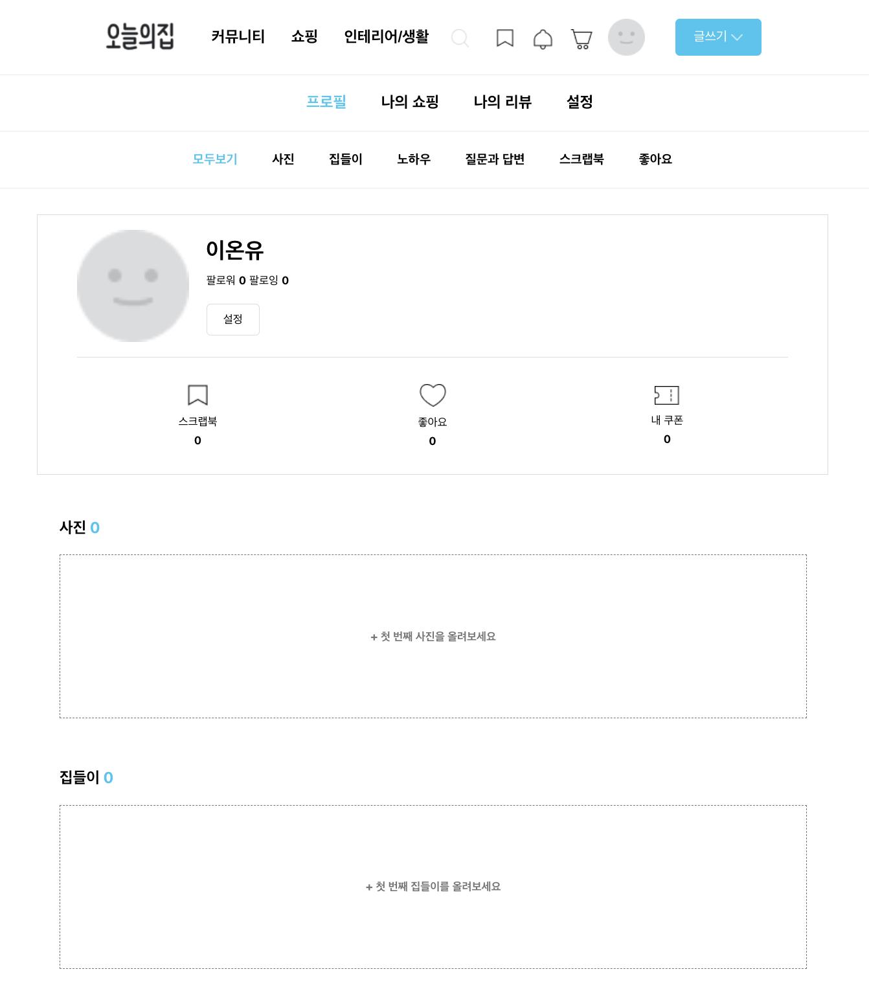
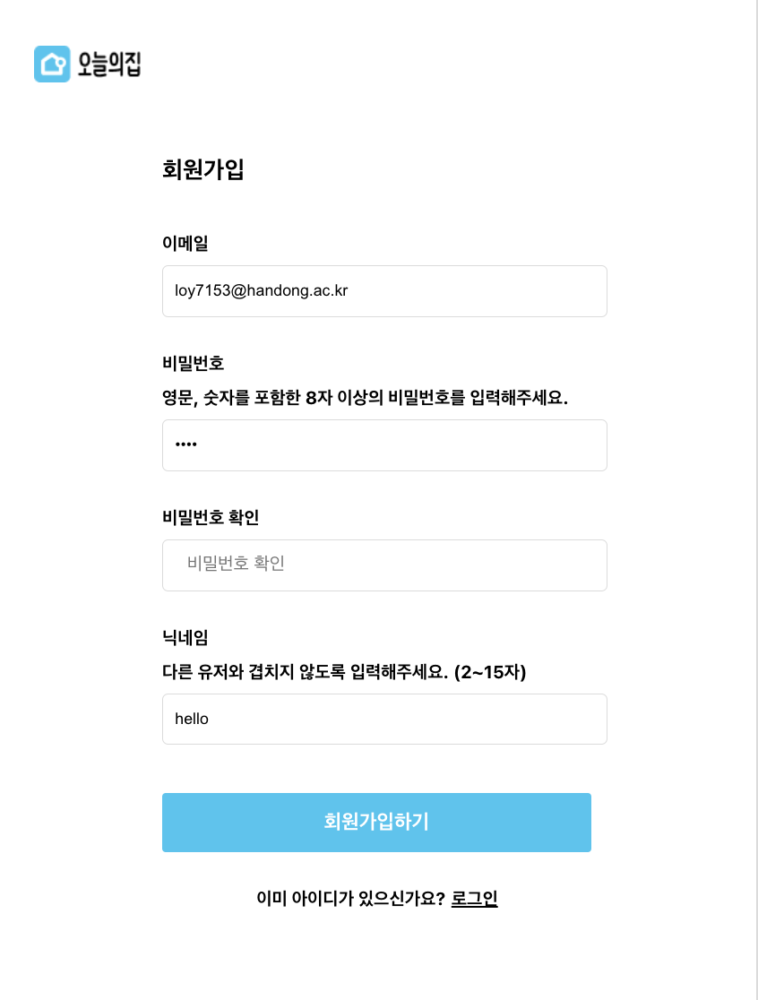
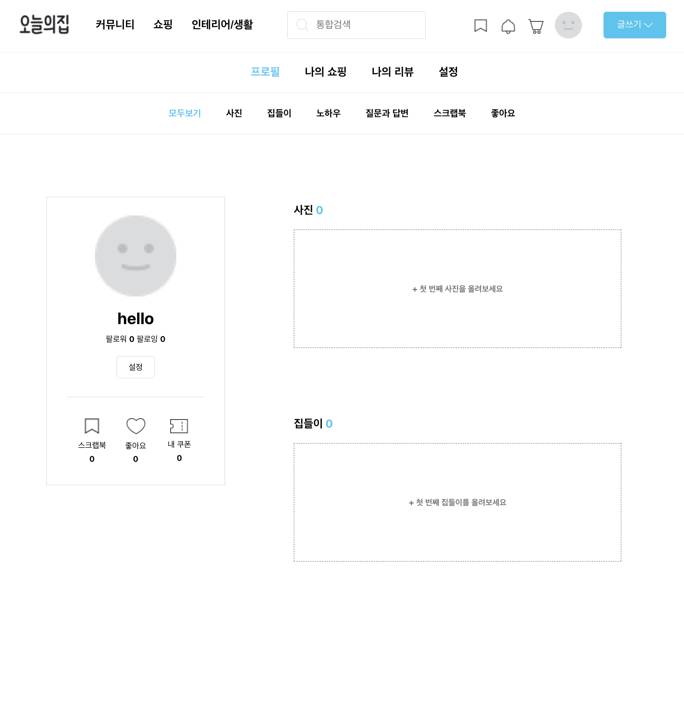
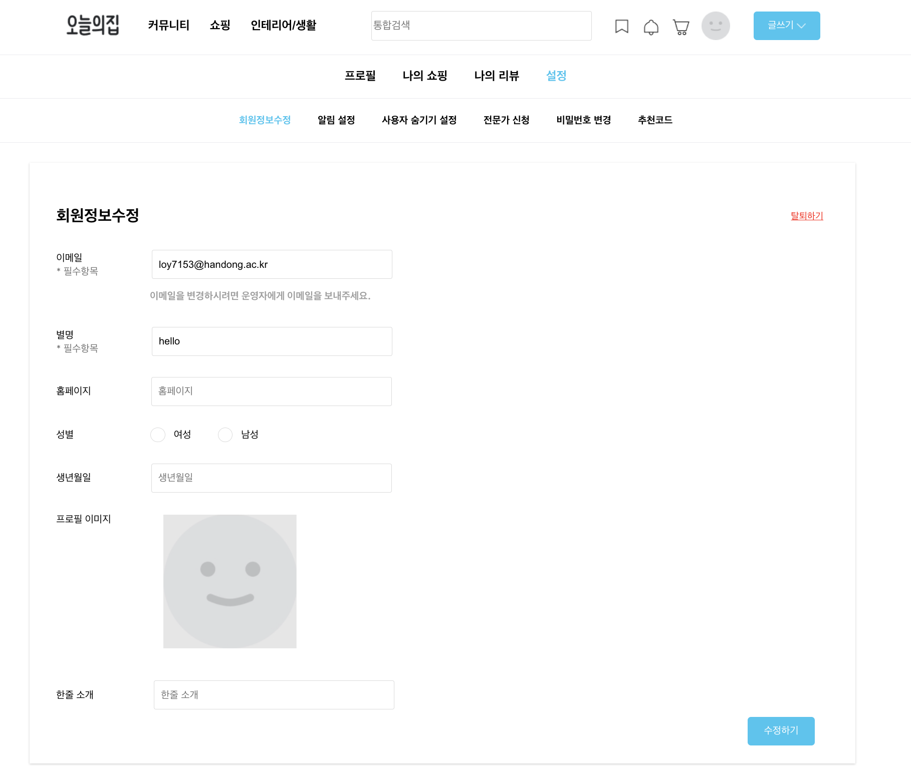
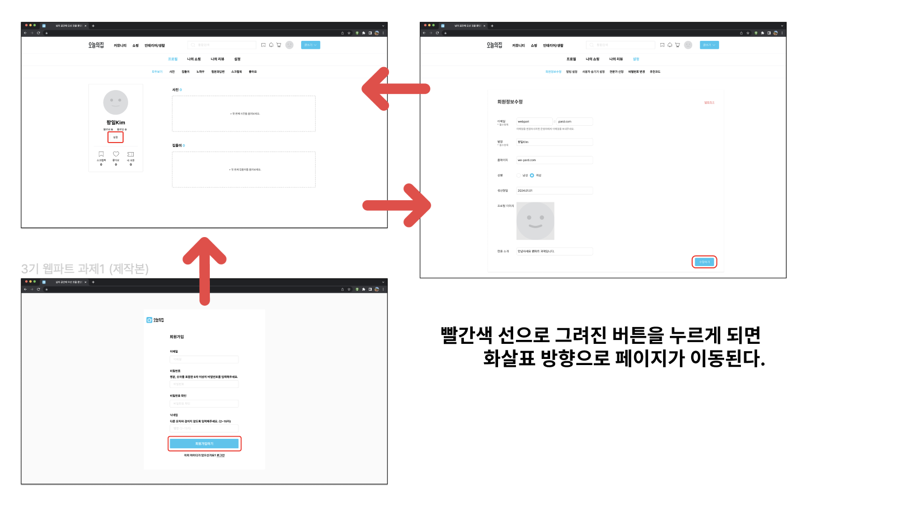
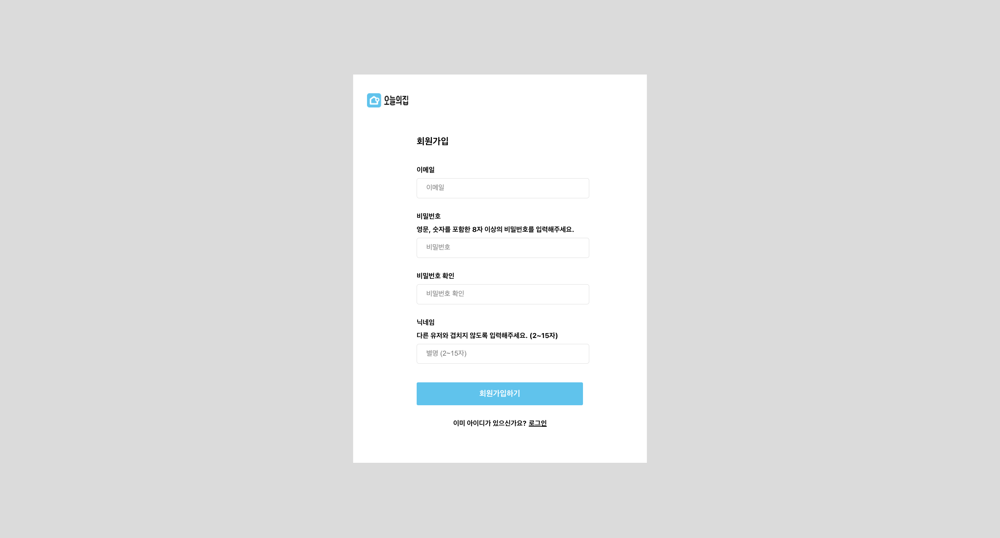
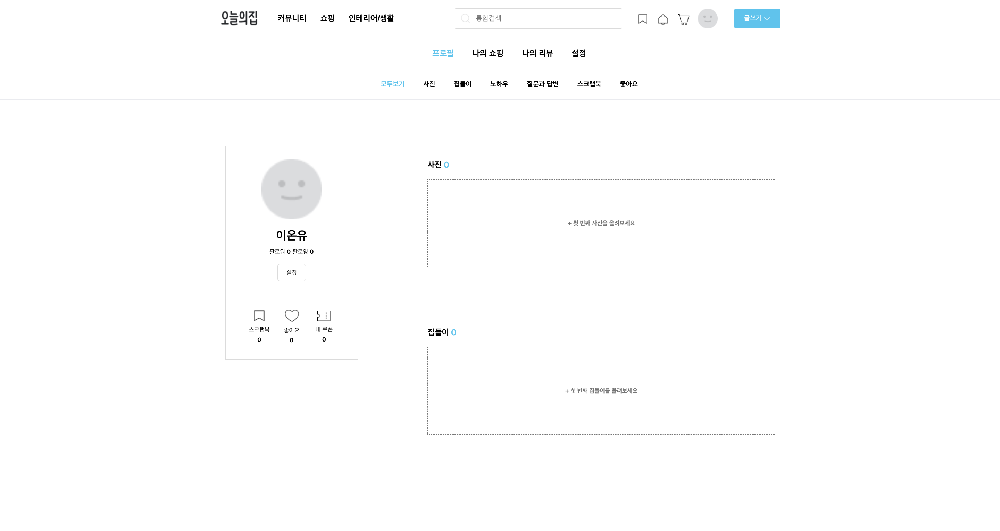

# HW#5
## 과제 목표
- JOSN server를 사용해서 server와 통신하는 AXIOS API 호출 방식에 익숙해질 수 있다.
- GET, PATCH를 수행할 수 있다.

## 초기 설정
- 라이브러리 설치 및 활성화
```
// 라이브러리 설치
$ npm install -g json-server

// 서버 활성화
// 포트번호는 client port번호를 제회한 모든 번호 가능
$ json-server --watch ./src/db/data.json --port 3001
```
- data.json 생성
```
{
  "users": [
    {
      "id": "1",
      "email": "loy7153@handong.ac.kr",
      "password": "1234",
      "nickname": "이온유",
      "homepage": "www.naver.com",
      "gender": "0",
      "date": "2003-04-03",
      "progileImage": "",
      "introduce": "안녕하세요 저는 온유예요!"
    }
  ]
}
```
### 결과
- recoil과 결과 유사

### 느낀점
- 이미지를 patch와 get구현을 못했는데 다음에 해보고 싶다.

# HW#4
## 과제 목표
- 전역 상태 라이브러리 Recoil을 사용할 수 있다.
- 반응형 웹 디자인을 구축할 수 있다.

### 반응형 웹
#### labtop


#### tablet


#### mobile


### Recoil
 

이메일과 비밀번호 저장 및 수정

# WEB_PART HW#2, HW#3
## 과제 목표
- React의 Router 라이브러리를 사용할 수 있다.
- URL 파라미터와 쿼리 스트링의 차이를 이해할 수 있다.
- Outlet을 통해 중첩 라우트를 구현할 수 있다.

## 과제설명
### 페이지 별 연결하기
목적 : 모든 페이지 별 페이지 이동에 대한 연습을 하는 부분!


#### RegisterPage


#### Profile


#### EditPage


한줄평:
기본 스타일을 버튼으로 한게 많아 `styled link`를 이용하여 `route`응용
코드가 좀 더러운 것 같아서 다음에는 더 깔끔하게...!